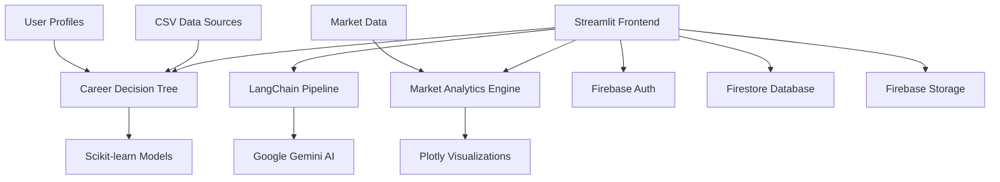

# 🚀 CareerSaathi – AI-Powered Career Intelligence Platform

[](https://streamlit.io/)
[](https://python.org/)
[](https://firebase.google.com/)
[](https://ai.google/)

**CareerSaathi** is a comprehensive AI-powered career intelligence platform that combines advanced machine learning with personalized coaching to help professionals navigate their career journey. From skill gap analysis to market insights, CareerSaathi provides data-driven recommendations tailored to each user's unique profile.

---

## ✨ Key Features

### 🎯 **AI-Powered Career Recommendations**
- **Decision Tree Algorithm**: Advanced ML model trained on 65+ career roles and market data
- **Personalized Predictions**: Tailored career path suggestions based on skills, experience, and goals
- **Real-time Analysis**: Dynamic recommendations that adapt as users update their profiles

### 📊 **Comprehensive Market Insights**
- **Interactive Salary Analysis**: Bubble charts, heatmaps, and range comparisons across career categories
- **Growth Potential Mapping**: Visual analysis of career growth vs. market demand
- **Industry Trends**: Real-time insights into high-demand skills and emerging opportunities

### 📈 **Advanced Career Gap Analysis**
- **Skill Gap Visualization**: Interactive charts showing current vs. required competencies
- **Development Timeline**: Personalized roadmaps with milestones and learning phases
- **Progress Tracking**: Built-in checklists and goal monitoring tools

### 🤖 **Intelligent AI Coaching**
- **Contextual Conversations**: LangChain-powered AI that remembers your career journey
- **Document Analysis**: Upload resumes and job descriptions for personalized insights
- **Multi-modal Support**: Text, document, and profile-based recommendations

### 🔐 **Secure & Persistent**
- **Firebase Authentication**: Secure user management with profile persistence
- **Cloud Storage**: Document uploads stored securely in Firebase Storage
- **Conversation History**: Long-term memory with Firestore for continuous learning

---

## 🏗️ Architecture Overview



### 🧩 **Core Components**

| Component | Technology | Purpose |
|-----------|------------|---------|
| **Frontend** | Streamlit | Multi-page web application with interactive UI |
| **AI Engine** | LangChain + Google Gemini | Conversational AI with context awareness |
| **ML Pipeline** | Scikit-learn | Decision tree models for career prediction |
| **Analytics** | Plotly + Pandas | Interactive data visualizations and insights |
| **Backend** | Firebase | Authentication, database, and file storage |
| **Data Processing** | Python + NumPy | ETL pipelines for career data analysis |

---

## 🚀 Quick Start

### Prerequisites
- Python 3.8+
- Firebase project with Authentication, Firestore, and Storage enabled
- Google AI API key

### Installation

1. **Clone the repository**
   ```bash
   git clone https://github.com/Rohit-1301/Career.git
   cd careersaathi
   ```

2. **Create virtual environment**
   ```bash
   python -m venv venv
   source venv/bin/activate  # On Windows: venv\Scripts\activate
   ```

3. **Install dependencies**
   ```bash
   pip install -r requirements.txt
   ```

4. **Environment Setup**
   ```bash
   # Copy environment template
   cp .env.example .env
   
   # Edit .env with your credentials
   GOOGLE_API_KEY=your_google_ai_api_key
   ```

5. **Firebase Configuration**
   - Place your Firebase service account JSON file in the project root
   - Update the path in your environment configuration

6. **Run the application**
   ```bash
   streamlit run streamlit_app/main.py
   ```

---

## 📁 Project Structure

```
careersaathi/
├── 📱 streamlit_app/           # Frontend application
│   ├── main.py                 # Main app entry point
│   ├── pages/                  # Multi-page application
│   │   ├── 1_💬_Chat.py       # AI chat interface
│   │   ├── 2_📄_Documents.py  # Document management
│   │   ├── 3_📊_History.py    # Conversation history
│   │   └── 4_🎯_Career_Insights.py  # Career analytics
│   └── components/             # Reusable UI components
├── 🤖 ai/                      # AI and ML components
│   ├── career_insights.py      # Decision tree models
│   ├── career_recommendations.py  # Recommendation engine
│   └── langchain_pipeline.py   # LangChain integration
├── 🔥 firebase/               # Firebase integrations
│   ├── auth.py                # Authentication services
│   ├── firestore.py           # Database operations
│   └── storage.py             # File storage management
├── ⚙️ services/               # Core business logic
│   └── utils.py               # Shared utilities
├── 📊 tech.csv                # Career salary data source
├── 🤖 career_model.joblib     # Trained ML models
├── 📋 requirements.txt        # Python dependencies
└── 🔧 .env.example           # Environment template
```

---

## 🎯 Core Features Deep Dive

### **1. Career Decision Tree Algorithm**
```python
# Advanced ML model for career prediction
- Input: Skills, experience, salary expectations, growth preferences
- Output: Personalized career recommendations with confidence scores
- Training Data: 65+ roles across 7 major career categories
- Accuracy: 65%+ prediction accuracy with continuous learning
```

### **2. Market Intelligence Dashboard**
- **Salary Analysis**: Interactive bubble charts and range comparisons
- **Growth Mapping**: Heatmaps showing growth vs. demand correlation
- **Skill Relevance**: Dynamic matching of user skills to market opportunities
- **Trend Indicators**: Real-time market demand and salary trend analysis

### **3. Career Gap Analysis Engine**
- **Skill Assessment**: Visual comparison of current vs. required competencies
- **Development Roadmap**: Personalized timelines with learning milestones
- **Resource Recommendations**: Curated learning paths and certification suggestions
- **Progress Tracking**: Interactive checklists and goal monitoring

### **4. AI-Powered Coaching**
- **Contextual Memory**: Persistent conversation history and user preferences
- **Document Intelligence**: Resume analysis and job description matching
- **Adaptive Responses**: Learning from user interactions and feedback
- **Multi-modal Input**: Support for text, documents, and structured data

---

## 🔧 Configuration

### **Environment Variables**
```bash
# Google AI Configuration
GOOGLE_API_KEY=your_google_ai_api_key

# Firebase Configuration
FIREBASE_TYPE=service_account
FIREBASE_PROJECT_ID=your_project_id
FIREBASE_PRIVATE_KEY_ID=your_private_key_id
FIREBASE_PRIVATE_KEY=your_private_key
FIREBASE_CLIENT_EMAIL=your_client_email
FIREBASE_CLIENT_ID=your_client_id
FIREBASE_AUTH_URI=https://accounts.google.com/o/oauth2/auth
FIREBASE_TOKEN_URI=https://oauth2.googleapis.com/token

# Application Settings
STREAMLIT_SERVER_PORT=8501
STREAMLIT_SERVER_ADDRESS=localhost
```

### **Firebase Setup**
1. Create a new Firebase project at [Firebase Console](https://console.firebase.google.com/)
2. Enable Authentication (Email/Password)
3. Create Firestore database
4. Enable Storage
5. Generate service account credentials
6. Download and place the JSON file in your project root

---

## 📊 Data Sources & Models

### **Career Data Pipeline**
- **Source**: `tech.csv` with 100+ tech career roles and salary data in LPA (Lakhs Per Annum)
- **Features**: Salary ranges, growth projections, skill requirements
- **Processing**: Advanced ETL with salary parsing and categorization
- **Output**: Structured data for ML training and market analysis

### **Machine Learning Models**
- **Algorithm**: Decision Tree Classifier with feature scaling
- **Features**: Experience level, skill count, salary expectations, growth preferences
- **Training**: Stratified sampling with cross-validation
- **Deployment**: Joblib serialization for production use

---

## 🧪 Testing & Quality Assurance

### **Test Suite**
```bash
# Run career tree tests
python test_career_tree.py

# Run personalization tests
python test_personalization.py
```

### **Test Coverage**
- ✅ Decision tree training and prediction
- ✅ User profile extraction and processing
- ✅ Recommendation engine functionality
- ✅ Personalization across different user types
- ✅ Data preprocessing and validation

---

## 🚀 Deployment Options

### **Local Development**
```bash
streamlit run streamlit_app/main.py
```

### **Streamlit Cloud**
1. Connect your GitHub repository
2. Set environment variables in Streamlit Cloud dashboard
3. Deploy with automatic builds

### **Docker Deployment**
```dockerfile
FROM python:3.9-slim
WORKDIR /app
COPY requirements.txt .
RUN pip install -r requirements.txt
COPY . .
EXPOSE 8501
CMD ["streamlit", "run", "streamlit_app/main.py"]
```

---

## 🤝 Contributing

We welcome contributions! Here's how you can help:

1. **Fork the repository**
2. **Create a feature branch** (`git checkout -b feature/amazing-feature`)
3. **Commit your changes** (`git commit -m 'Add amazing feature'`)
4. **Push to the branch** (`git push origin feature/amazing-feature`)
5. **Open a Pull Request**

### **Development Guidelines**
- Follow PEP 8 style guidelines
- Add tests for new features
- Update documentation for significant changes
- Ensure all tests pass before submitting

---

## 📈 Future Roadmap

### **Upcoming Features**
- 🎓 **Certification Tracking**: Integration with major certification providers
- 🌐 **Job Market Integration**: Real-time job posting analysis
- 👥 **Networking Features**: Professional connection recommendations
- 📱 **Mobile App**: React Native mobile application
- 🤖 **Advanced AI**: GPT-4 integration and voice interactions

### **Technical Improvements**
- 🔄 **Real-time Updates**: WebSocket integration for live recommendations
- 📊 **Advanced Analytics**: Time-series analysis and predictive modeling
- 🔐 **Enhanced Security**: OAuth2 and multi-factor authentication
- ⚡ **Performance**: Caching and database optimization

---

## 📄 License

This project is licensed under the MIT License - see the [LICENSE](LICENSE) file for details.

---

## 🙏 Acknowledgments

- **Google AI**: For providing the Gemini API
- **Streamlit**: For the amazing web app framework
- **Firebase**: For backend infrastructure
- **LangChain**: For AI orchestration
- **Plotly**: For interactive visualizations
- **Scikit-learn**: For machine learning capabilities

---

## 📞 Support & Contact

- **Issues**: [GitHub Issues](https://github.com/Rohit-1301/Career/issues)
- **Discussions**: [GitHub Discussions](https://github.com/Rohit-1301/Career/discussions)
- **Email**: career.saathi@gmail.com

---

<div align="center">

**Built with ❤️ by the CareerSaathi Team**

[⭐ Star this repo](https://github.com/Rohit-1301/Career) | [🐛 Report Bug](https://github.com/Rohit-1301/Career/issues) | [💡 Request Feature](https://github.com/Rohit-1301/Career/issues)

</div>
- **AI Layer:** LangChain + `langchain-google-genai` wrapping Gemini models.
- **Data Layer:** Firebase Auth for users, Firestore for history, Storage for uploads.
- **Support:** `services/utils.py` centralises logging and environment loading.

---

## 📁 Project Structure

```
careersaathi/
├── ai/
│   ├── gemini_client.py          # Gemini client wrapper
│   └── langchain_pipeline.py     # Conversation orchestration + memory
├── firebase/
│   ├── auth.py                   # Authentication helpers
│   ├── config.py                 # Shared Firebase initialisation logic
│   ├── db.py                     # Firestore utilities
│   ├── storage.py                # Firebase Storage helpers
│   └── functions/                # Reserved for Cloud Functions integrations
├── services/
│   └── utils.py                  # Logging + environment helpers
├── streamlit_app/
│   ├── app.py                    # Entry point with auth gate
│   ├── components/               # Streamlit widgets (auth, chat, session)
│   └── pages/                    # Dashboard, History, Uploads views
├── .env.example                  # Environment template
├── requirements.txt              # Python dependencies
└── README.md
```

---

## ✅ Prerequisites

- Python **3.10+** (3.11 recommended)
- Firebase project with **Authentication**, **Firestore (Native)**, and **Storage** enabled
- Google Gemini API access (create a key in [Google AI Studio](https://aistudio.google.com/app/apikey))

---

## 🚀 Getting Started

### 1. Clone the repository
```powershell
git clone <your-fork-url> careersaathi
cd careersaathi
```

### 2. Create a virtual environment & install deps
```powershell
python -m venv .venv
\.\.venv\Scripts\Activate.ps1
pip install --upgrade pip
pip install -r requirements.txt
```

### 3. Configure environment variables

1. Copy `.env.example` ➜ `.env`.
2. Populate Firebase keys (from **Project settings → General → Your apps → Firebase SDK snippet**).
3. Download a **Firebase Admin SDK** JSON file and set `GOOGLE_APPLICATION_CREDENTIALS` to its absolute path.
4. Set `GEMINI_API_KEY` with the key from Google AI Studio.

> **Bucket naming tip:** Firebase’s default bucket follows `project-id.appspot.com`. Ensure `FIREBASE_STORAGE_BUCKET` matches the bucket shown in the Storage console (look for the `gs://` string).

### 4. Enable Firebase products

- **Authentication:** Turn on *Email/Password*.
- **Firestore:** Start in *Native mode*.
- **Storage:** Click **Get Started**, choose a location, then update the bucket rules to allow authenticated access:

```javascript
rules_version = '2';
service firebase.storage {
  match /b/{bucket}/o {
    match /{allPaths=**} {
      allow read, write: if request.auth != null;
    }
  }
}
```

### 5. Run the Streamlit app
```powershell
streamlit run streamlit_app/app.py
```

### 6. Sign up & explore

- Create an account from the landing screen.
- Ask questions on **Dashboard**, upload files alongside prompts, and view inline AI responses.
- Revisit previous conversations via **History** and download/delete uploads from **Uploads**.

---

## ⚙️ Configuration Reference

| Variable | Description |
| --- | --- |
| `FIREBASE_API_KEY` | Web API key from Firebase project settings |
| `FIREBASE_AUTH_DOMAIN` | Typically `<project-id>.firebaseapp.com` |
| `FIREBASE_DATABASE_URL` | Optional; used if Realtime Database is enabled |
| `FIREBASE_PROJECT_ID` | Your Firebase project ID |
| `FIREBASE_STORAGE_BUCKET` | Storage bucket name (e.g., `project-id.appspot.com`) |
| `GOOGLE_APPLICATION_CREDENTIALS` | Absolute path to Firebase Admin SDK service account JSON |
| `GEMINI_API_KEY` | Google AI Studio API key |
| `APP_SECRET_KEY` | Streamlit session secret |

Restart the Streamlit server whenever `.env` or credentials change.

---

## 🧪 Development & Validation

- **Type / syntax check:**
  ```powershell
  python -m compileall ai firebase services streamlit_app
  ```
- **Run unit tests (if added later):**
  ```powershell
  pytest
  ```
- To experiment with Gemini prompts, open a Python shell and interact with `ai/gemini_client.py` directly.

---

## 🧰 Troubleshooting

| Symptom | Likely Cause | Fix |
| --- | --- | --- |
| `ModuleNotFoundError` for local packages | `sys.path` not updated | Relaunch via `streamlit run streamlit_app/app.py` from project root |
| Firebase auth errors (`OPERATION_NOT_ALLOWED`) | Email/Password provider disabled | Enable provider in Firebase Authentication console |
| `ValueError: The default Firebase app does not exist` | Admin SDK not initialised | Ensure `GOOGLE_APPLICATION_CREDENTIALS` points to a valid service account JSON |
| `404 ... The specified bucket does not exist` | Wrong `FIREBASE_STORAGE_BUCKET` value | Copy the exact bucket name shown in Firebase Storage (`gs://…`) |
| Gemini `404 models/... not found` | Model unavailable for API key | Use `gemini-pro` or `gemini-2.0-flash-lite` (check [model availability](https://ai.google.dev/gemini-api/docs/models)) |

---

## 🛣️ Roadmap Ideas

- Add semantic retrieval for uploaded files (e.g., LangChain retrievers + embeddings).
- Introduce team spaces & role-based access controls.
- Deploy Cloud Functions for scheduled nudges or resume analysis jobs.
- Expand analytics with Streamlit charts powered by Firestore aggregates.

---

## 🤝 Contributing

Issues and pull requests are welcome. Please open an issue to discuss large feature ideas before starting work.

Happy coaching! ✨
